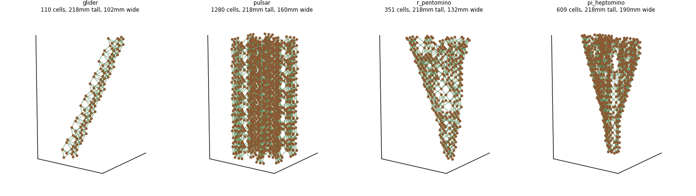

# conway3d

Turns a run of Conway's Game of Life into a single STL that 3D prints in one
piece, with no assembly and no support material.

The Game of Life is two dimensional and unfolds over time. This treats time as
the third dimension: generation 0 sits on the build plate or lives freely and each later
generation is stacked 10 mm above the one before, so the finished print is the
whole history of the pattern, readable from bottom to top.



Left to right: a glider leaning as it travels, a pulsar repeating every three
layers, and the R-pentomino and pi-heptomino widening as they run. Made with
`preview.py`, which draws the structure without building any geometry.

## What the model is made of

Every live cell becomes one solid part placed on a 10 mm cubic lattice at
`(x, y, generation)`. Nothing else about the simulation is represented. Boundaries
can be imposed so cells that extend beyond do not spawn, and in consequence do 
not get included into the STL.

Generations do not touch each other directly. A cell part is 7.15 mm tall on a
10 mm pitch, so there is a 2.85 mm gap between one generation and the next.
That gap is bridged by **rungs**: wherever a live cell has a live *neighbour*
in the next generation, a strut is placed linking the two. There are two rung
parts, one for an orthogonal step and a longer one for a diagonal step.

### Settings

`--base` takes one of four values.

| `--base` | what you get |
|---|---|
| `cells` | a square footing under each generation 0 cell. The default, and what the original project did |
| `none` | nothing. Cells and rungs only, for a piece to turn over in your hand |
| `plate` | a round plate and no footings |
| `both` | footings and plate |
| `--boundary` | behaviour |
|---|---|
| `grow` | the grid is enlarged as far as the run could need, so the pattern spreads freely and the result is Life on an unbounded plane. The default |
| `wall` | the grid stays exactly as given and everything outside it is permanently dead, so a pattern reaching the edge is cut off |

## Installing

```
pip install -r requirements.txt
```

Needs numpy, scipy and numpy-stl. Pillow is only used for `--image`, and
matplotlib only for previews and plots. The drawing tool uses tkinter, which
ships with Python but is a separate package on some Linux distributions
(`python3-tk`).

## Building a model

```
python conway3d_stl.py --pattern gosper_glider_gun --frames 40 \
    --base both --center --binary --out output_stls/gun.stl

# the same run with nothing underneath, to hold rather than stand up
python conway3d_stl.py --pattern gosper_glider_gun --frames 40 \
    --base none --binary --out output_stls/gun_handheld.stl
```

The initial condition comes from exactly one of:

- `--pattern NAME` — a grid defined in `init_grids.py`
- `--array FILE` — a pattern file of on/off cells, see below
- `--image FILE` — a 1-bit bitmap, where black pixels are live cells

Other options:

| flag | effect |
|---|---|
| `--frames N` | generations to run, counting the initial one. Sets the height. |
| `--base MODE` | `cells`, `none`, `plate` or `both`. Default `cells` |
| `--base-radius`, `--base-thickness`, `--base-segments` | override the plate, default radius covers the model, 3 mm thick, 180 facets |
| `--center` | move the model over the origin, ready to slice |
| `--binary` | write a binary STL. Roughly four times smaller than the default ASCII |
| `--model-stls DIR` | choose the part set, default `./model_stls/version3` |
| `--unit MM` | lattice pitch, must match the parts |
| `--boundary MODE` | `grow` or `wall`. Default `grow` |
| `--pad N` | surround the starting grid with N dead cells |
| `--plot`, `--verbose` | diagnostic plots, and a line per rung placed |

It prints the cell and rung counts, what base was used, the triangle count and
how many separate pieces the result is in.

## The named patterns

`init_grids.py` defines the standard Life menagerie, and `--pattern` takes any
of these names. Because time is the vertical axis, what each one does in the
plane decides what it looks like as a print:

- a **still life** never changes, so it prints as a straight prism;
- an **oscillator** returns to itself every *p* generations, so it prints as a
  column that repeats every *p* layers;
- a **spaceship** translates steadily, so it prints as a leaning column whose
  angle is how far it moves per generation;
- a **methuselah** stays chaotic for a long time from a tiny seed, so it prints
  as an irregular branching mass;
- a **gun** is a fixed machine that emits spaceships, so it prints as a still
  core with leaning columns streaming away from it at a regular interval.

| pattern | kind | behaviour | frames | cells | rungs | prints as |
|---|---|---|---|---|---|---|
| `block` | still life | - | 22 | 88 | 252 | one piece |
| `beehive` | still life | - | 22 | 132 | 252 | 2 pieces, needs a plate |
| `loaf` | still life | - | 22 | 154 | 294 | one piece |
| `boat` | still life | - | 22 | 110 | 252 | one piece |
| `tub` | still life | - | 22 | 88 | 168 | 2 pieces, needs a plate |
| `blinker` | oscillator | p2 | 22 | 66 | 168 | one piece |
| `toad` | oscillator | p2 | 22 | 132 | 336 | one piece |
| `beacon` | oscillator | p2 | 22 | 154 | 378 | 2 pieces, needs a plate |
| `pulsar` | oscillator | p3 | 22 | 1280 | 3304 | 4 pieces, needs a plate |
| `pentadecathlon` | oscillator | p15 | 31 | 640 | 1672 | one piece |
| `glider` | spaceship | 1 diagonal / 4 | 22 | 110 | 284 | one piece |
| `lwss` | spaceship | 2 straight / 4 | 22 | 231 | 622 | 2 pieces, needs a plate |
| `mwss` | spaceship | 2 straight / 4 | 22 | 286 | 770 | 3 pieces, needs a plate |
| `hwss` | spaceship | 2 straight / 4 | 22 | 341 | 918 | 4 pieces, needs a plate |
| `r_pentomino` | methuselah | 1103 gens | 22 | 351 | 936 | one piece |
| `acorn` | methuselah | 5206 gens | 22 | 436 | 1160 | one piece |
| `diehard` | methuselah | dies at 130 | 22 | 359 | 955 | one piece |
| `b_heptomino` | methuselah | 148 gens | 22 | 356 | 961 | one piece |
| `pi_heptomino` | methuselah | 173 gens | 22 | 609 | 1636 | one piece |
| `gosper_glider_gun` | gun | 1 glider / 30 | 40 | 1981 | 5365 | 2 pieces, needs a plate |

Counts are for `model_stls/version3` at the frame count shown. Where a pattern
comes out in several pieces it is because the cells fall into sub-lattices that
the rungs never bridge — a ring like the beehive alternates parity going up, and
a spaceship leaves its old position behind. Every one of them still reaches the
build plate, so `--base plate` or `--base both` joins them into a single print;
none of them float.

Period and displacement for every one of these, and the settling generation and
population for the methuselahs, are asserted in `test_pipeline.py` against the
documented values, so a pattern that is wrong here fails the suite.

## Drawing your own

```
python designer.py
python designer.py --load my_pattern.txt
python designer.py --rows 61 --cols 61 --frames 22
```

A small window. Set the size of the domain and press **Resize domain**, then
paint live cells with the left mouse button and erase with the right. Dragging
paints continuously.

The **base** and **boundary** dropdowns offer the same choices as `--base` and
`--boundary` on the command line, and the summary updates to match.

The side panel keeps a running summary as you draw: how many cell and rung
parts the model will need, how tall and wide it will print, the footing count
and plate diameter where they apply, how far the domain had to grow, and how
many separate pieces it will be in. It warns you when

- the wall is actually cutting the pattern off, with the number of cell parts
  lost, which means you are no longer simulating Life. It only says this when
  the wall really changes the outcome, not merely when the pattern gets close;
- nothing survives to the last generation;
- the model would come out in several pieces, which only a plate can join;
- the base is set to `none`, so nothing holds the result on the build plate.

**Preview 3D** draws the structure without building geometry. **Generate STL…**
writes the file, on a background thread so the window stays responsive.
**Open…** and **Save as…** read and write the pattern files described next, so
a design can be put away and picked up again.

## Pattern files

A pattern file holds nothing but the on/off cells. `init_grids.load_pattern()`
reads two forms.

**Text**, one line per row:

```
! lines starting with an exclamation mark are comments
.#.
..#
###
```

`#`, `O`, `o`, `*`, `X`, `x` and `1` are live. `.`, `0`, `-`, `_` and space are
dead. Values may be separated by commas, tabs or spaces, so a 0/1 grid exported
from a spreadsheet loads unchanged; otherwise each character is one cell. Short
rows are padded with dead cells.

Every line is a row, blank ones included, so the file's shape *is* the domain
and saving then loading returns exactly what you drew. This also reads the
plaintext `.cells` files used elsewhere in the Life world.

**NumPy**, a `.npy` file or a `.npz` whose first array is used. Any non-zero
value counts as live.

`init_grids.save_pattern(grid, path)` writes text, or NumPy if the name ends in
`.npy`.

## Part sets

`model_stls/` holds three generations of the four parts. Each directory must
contain `base.stl`, `cell.stl`, `rung_adj.stl` and `rung_diag.stl`.

| set | base | cell | rung, orthogonal | rung, diagonal |
|---|---|---|---|---|
| `version1` | 822 | 812 | 900 | 900 |
| `version2` | 924 | 812 | 774 | 732 |
| `version3` | 900 | 812 | 622 | 748 |

`version3` is the default. All three are exercised by the tests. They differ in
detail and triangle count, not in lattice pitch, so any of them can be swapped
in with `--model-stls`.

## Printing notes

- **Height.** 22 generations is 217.6 mm, which is over the 210 mm limit of
  some printers. Drop to 20 generations for 197.6 mm.
- **Overhangs.** The rungs are steep. The orthogonal one rises 27.1° above
  horizontal and the diagonal one 21.4°. They are short, 2.5 mm wide and land
  on a cell at each end.
- **Print in place.** There is nothing to assemble and no support is intended.
  The model is one connected solid provided the tools say it is one piece.
- **`--base none` is for handling, not for printing straight off.** With
  nothing underneath, generation 0 cells meet the bed at a rounded point.
  Print it with footings and remove them, or use supports.
- **The STL is a soup of overlapping closed solids**, not a single manifold
  surface. Slicers union it without complaint, but mesh validators will report
  it as not closed. That is expected.
- **File size.** Use `--binary`. ASCII STL is around four times larger for the
  same geometry, and these models run to hundreds of thousands of triangles.
- Generated models go to `output_stls/`, which is deliberately not tracked by
  git.

## Layout

```
preview.png         the picture at the top of this file
conway3d_stl.py     the pipeline: run Life, place parts, write the STL
designer.py         draw a pattern with the mouse and build it
preview.py          render a model to PNG without building geometry
init_grids.py       the named patterns, and pattern file reading
test_pipeline.py    the test suite
model_stls/         the four building blocks, three versions
initial_states/     example bitmaps
output_stls/        generated models land here, not tracked
```
